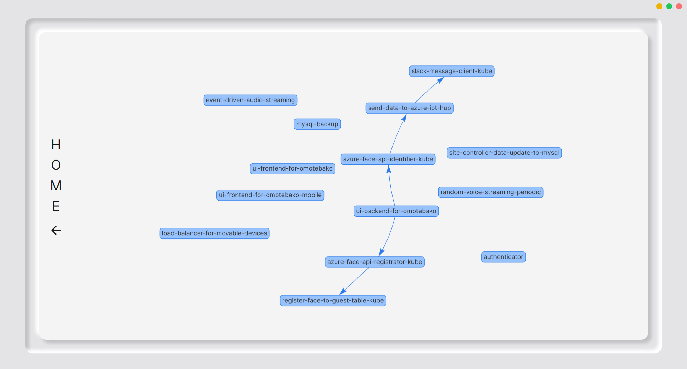

# vis-js  
vis-jsは、[avis](https://github.com/latonaio/avis)で使用されているvis.jsの関連リソースです。  
vis.jsはブラウザベースの動的な視覚化ライブラリで、大量の動的データの処理や、データの操作、データの相互作用を可能にします。  
[avis](https://github.com/latonaio/avis)では、vis-jsを用いてマイクロサービス等で収集された動的なログの処理を行っています。

# avisにおけるvis-jsを使用したUI  

